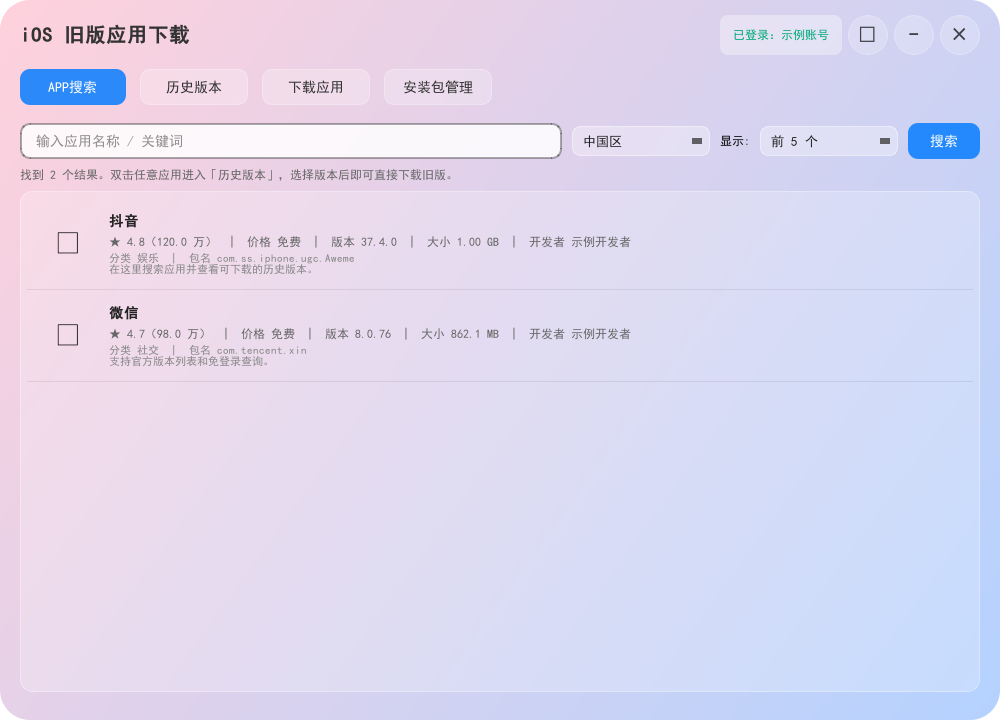
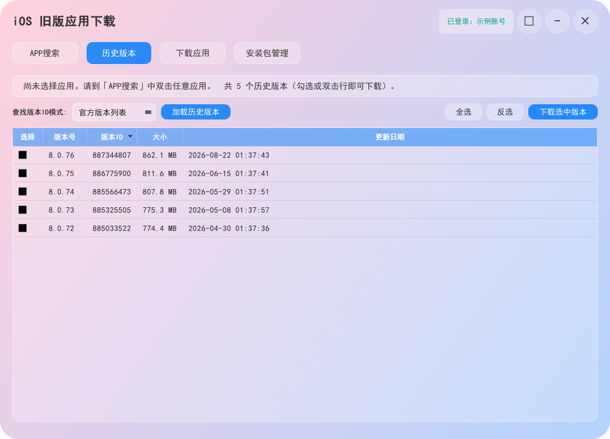
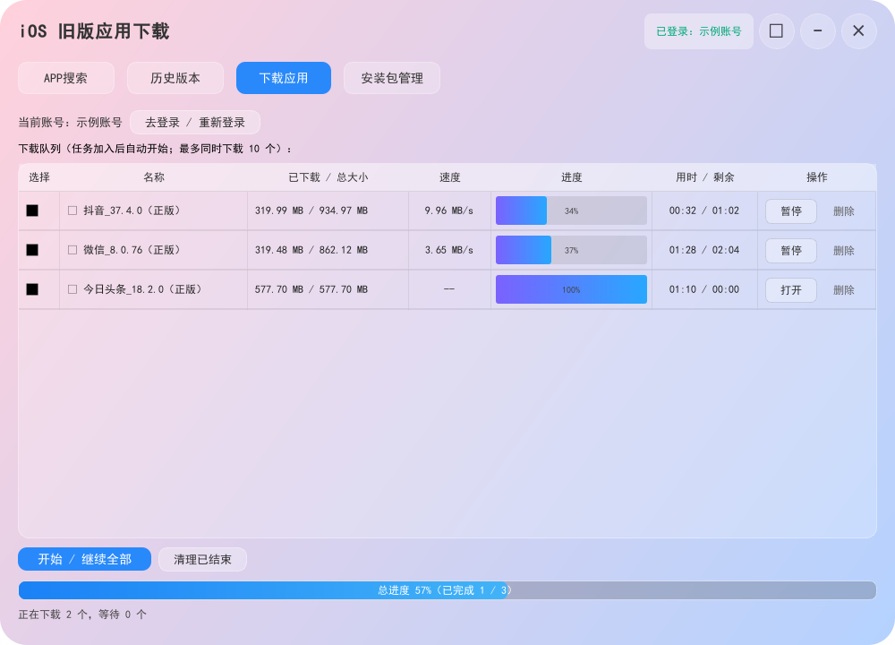
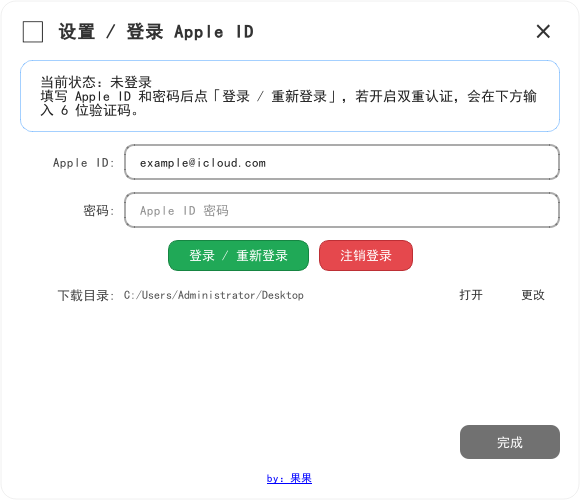

# iOS App Downloader

一个简单易用的 Windows iOS 旧版应用下载工具。它可以搜索 App Store 应用、查看历史版本，并将指定版本下载为 IPA 文件，方便后续使用爱思助手、iMazing 等工具导入安装。

## 功能

- Apple ID 登录，支持双重认证验证码
- 登录自动尝试系统代理、本机代理端口和直连，不要求手动切换节点
- 账号会话只在本次运行期间有效，注销、退出或下次启动都会清理
- 中国区优先，也支持中国香港、中国澳门、中国台湾及其他区域
- 历史版本支持“官方版本列表”和“免登录查询”两种方式
- 下载队列支持最多同时下载 10 个任务
- 每个任务独立显示大小、速度、进度、用时和剩余时间
- 下载完成后可直接打开保存文件夹
- 内置玻璃重量计算器同款透明图标，Windows 文件属性包含产品名、版本和版权信息
- 设置中支持“跟随系统 / 简体中文 / English”，跟随系统时会自动读取 Windows 系统语言

## 使用说明

1. 双击 `iOSAppDownloader.exe`。
2. 点击右上角设置按钮，登录 Apple ID；如果账号启用了双重认证，在验证码框输入 6 位验证码。
3. 在“APP搜索”中输入应用名称并搜索，双击应用进入“历史版本”。
4. 选择“官方版本列表”或“免登录查询”，勾选需要的版本后加入下载队列。
5. 下载完成后，点击任务中的“打开”或使用设置页的“打开”按钮查看 IPA 文件。

选择中国区以外的区域时，软件会提示需要拥有对应区域 App Store 权限的 Apple ID。没有对应区域账号时，免登录查询仍可用于查看资料，但官方版本获取和下载可能无法完成。

## 软件截图

以下为软件实际界面截图。截图中的账号、下载路径均为公开示例信息，不是实际用户隐私。

### 应用搜索

### 历史版本

### 下载队列

### Apple ID 设置

## 发布说明

仓库同时提供 Windows 成品程序和项目源码：

- `iOSAppDownloader.exe`：开箱即用的 Windows 成品
- `ios_old_app_downloader.py`：主程序源码
- `ios_old_app_downloader.spec`、`version_info.txt`、`appstore.ico`：打包所需文件
- `ipatool/`：运行所需的 ipatool-rs 组件

普通用户直接下载 `iOSAppDownloader.exe` 即可；开发者可以查看源码并按自己的环境重新打包。

### 修改语言和首页提示

中英文界面文案集中在 `ios_old_app_downloader.py` 顶部的 `TRANSLATIONS` 字典；首页“请先登录”弹窗在 `startup_login_message()` 中修改。默认“跟随系统”会按 Windows/Qt 系统区域自动选择中文或 English，设置中手动选择后立即生效。

## 接口来源

本软件的 Apple ID 登录、版本列表和 IPA 下载能力使用开源项目 **ipatool** 的接口能力；本成品内置的 Windows 运行组件来自 [Kosthi/ipatool-rs](https://github.com/Kosthi/ipatool-rs)。
